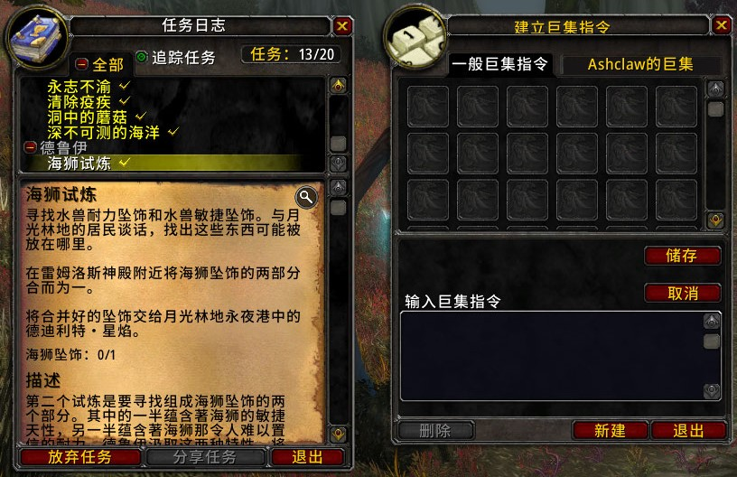

# 有爱黑体 伪简体

[有爱黑体](https://github.com/nowar-fonts/Nowar-Sans)是《魔兽世界》和《魔兽世界：经典怀旧服》字体包。该 “伪简体” 字体包按照 [Open Chinese Convert](https://github.com/BYVoid/OpenCC) 提供的 “繁—简” 转换规则，将繁体字码位映射到对应的简化字字形上。

与常规版本的有爱黑体不同的是，“伪简体” 字体包只支持 GB 18030 字符集，且只覆盖 zhTW 常用的字体文件。

## 下载指南

[GitHub 上的最新版](https://github.com/nowar-fonts/Nowar-Sans-Pseudo-SC/releases)

镜像：[Gitee 上的最新版](https://gitee.com/nowar-fonts/Nowar-Sans-Pseudo-SC/releases)

“有爱黑体 伪简体” 有 2 个版本，各有 4 种字重。

### 字重

* 300：细体
* 400：常规
* 500：中等
* 700：粗体

### GBP — 标准版本，聊天字体保持正常映射

| 文件名            | 属性       | 适用语言     | 说明                                  |
| ----------------- | ---------- | ------------ | ------------------------------------- |
| `ARIALN.ttf`      | 伪简体，UI | 欧洲诸国语言 | 聊天字体（某些插件中硬编码了此字体）  |
| `arheiuhk_bd.ttf` | 正常映射   | 繁体中文     | 聊天字体（决战艾泽拉斯）              |
| `bHEI00M.ttf`     | 伪简体     | 繁体中文     | 工具提示字体                          |
| `bHEI01B.ttf`     | 正常映射   | 繁体中文     | 聊天字体（经典版）                    |
| `bKAI00M.ttf`     | 伪简体     | 繁体中文     | 伤害字体                              |
| `blei00d.ttf`     | 伪简体     | 繁体中文     | 界面主字体                            |
| `FRIZQT__.ttf`    | 伪简体，UI | 欧洲诸国语言 | 界面主字体（某些插件中硬编码了此字体）|

* UI：中西文共用的标点视作西文标点；半角 CJK 标点；比例假名。

### GBPC — 完全简化版本，聊天字体也是伪简体

这个版本全部使用伪简体字体，可以让聊天框里的 NPC 对话、系统提示、拾取信息等也显示成简化字。但是同时也会把你输入的繁体字显示成简化字，可能导致你输入错误的字符，使得别人看起来简繁混乱。
